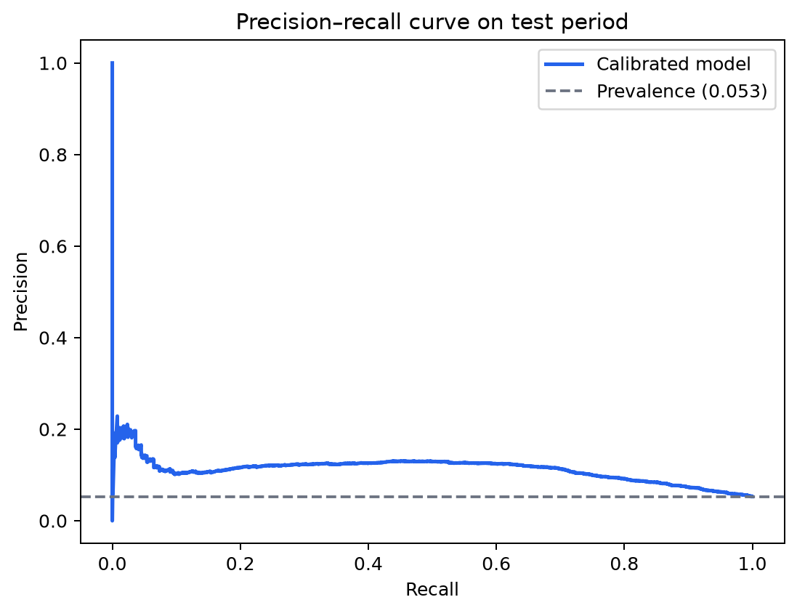
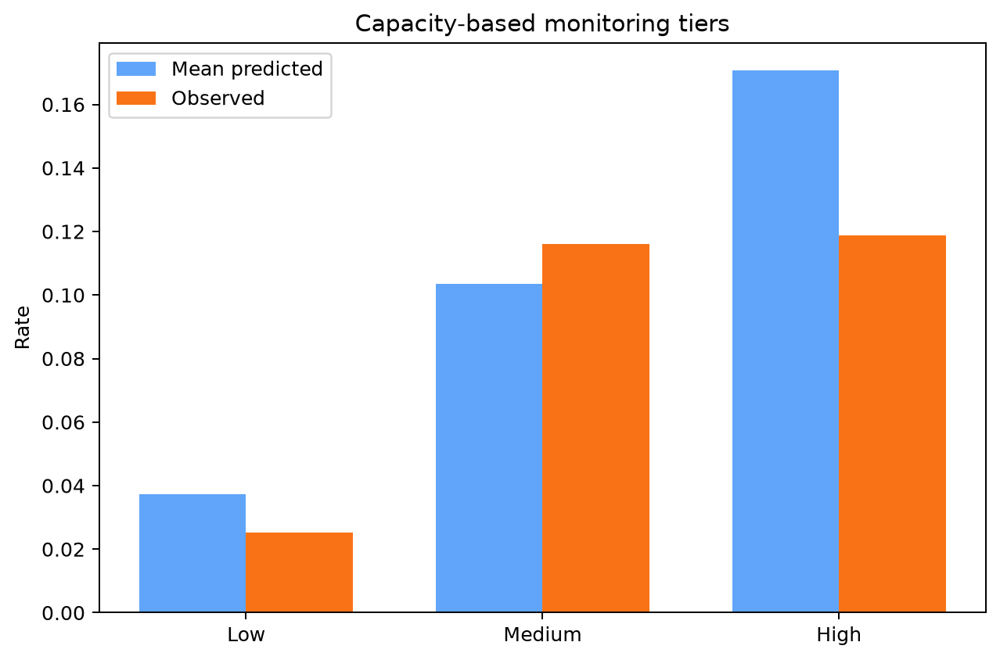
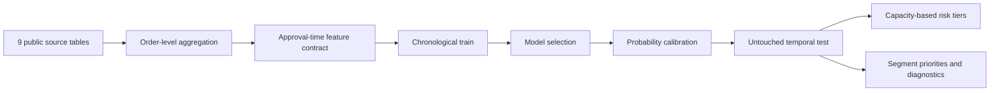
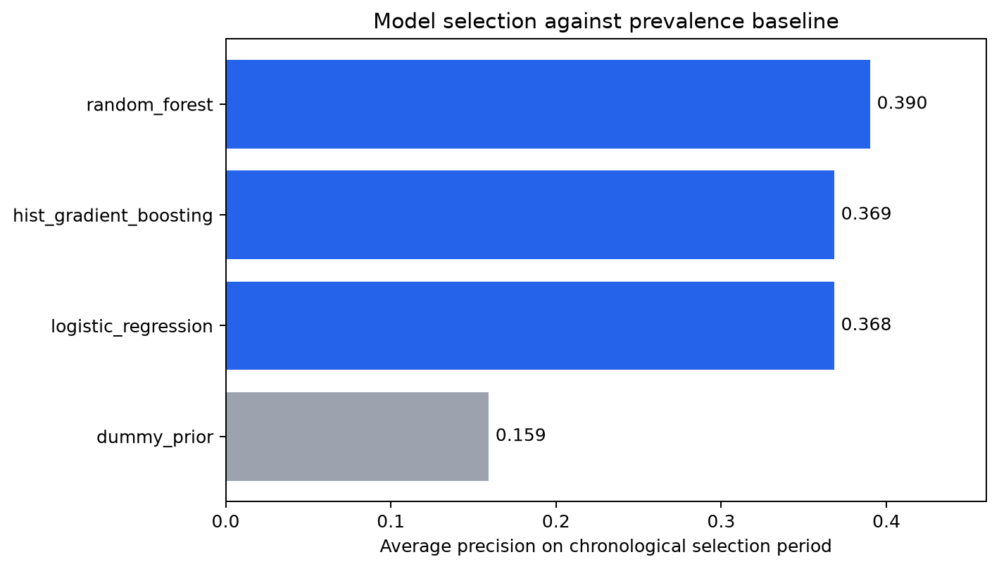
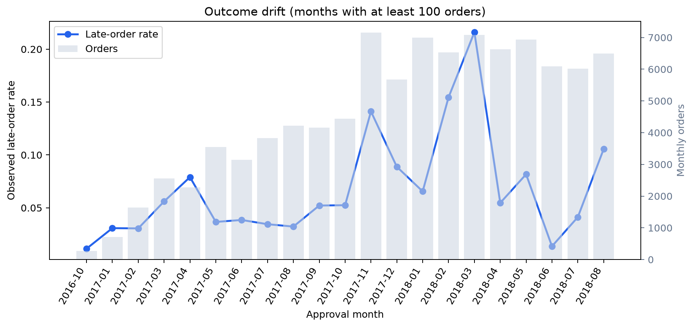

# Olist Delivery Risk

[](https://github.com/ArmutS/olist-delivery-risk/actions/workflows/ci.yml)
[](https://www.python.org/)
[](LICENSE)
[](https://creativecommons.org/licenses/by-nc-sa/4.0/)

A reproducible machine-learning case study that estimates delivery-delay risk at order approval time using the public Olist Brazilian E-Commerce dataset. The project turns raw relational tables into a leakage-controlled order-level dataset, compares multiple classifiers chronologically, calibrates the selected model, and translates scores into capacity-based monitoring tiers.

## Business question

> When an order is approved, which orders should receive early operational attention because they are most likely to arrive after the promised date?

The target is `1` when the actual customer delivery date is later than the estimated delivery date. The prediction cutoff is `order_approved_at`; carrier events, actual delivery, delay duration, and reviews are excluded from model features.

## Headline results

The final evaluation uses the latest 20% of orders as an untouched chronological test set: 19,280 orders approved from 26 May to 29 August 2018, with a 5.28% late-order prevalence.

| Test metric | Result |
|---|---:|
| Selected model | Random forest |
| ROC AUC | 0.733 |
| Average precision | 0.113 |
| Prevalence baseline | 0.053 |
| Lift among top 10% | 2.25× |
| Recall among top 30% | 66.5% |
| Brier score | 0.0486 |
| 10-bin calibration error | 0.0111 |



The top 30% of test orders contained 66.5% of all late orders. The High and Medium tiers, however, had nearly equal realized late rates (11.88% and 11.62%). The useful distinction in this period is therefore monitored top 30% versus Low, rather than a strong separation between High and Medium.

| Tier | Capacity | Orders | Observed late rate | Late orders captured |
|---|---:|---:|---:|---:|
| High | 10% | 1,928 | 11.88% | 229 |
| Medium | 20% | 3,856 | 11.62% | 448 |
| Low | 70% | 13,496 | 2.53% | 341 |



## Workflow



The workflow includes four candidate models: prior-only baseline, logistic regression, random forest, and histogram gradient boosting. Average precision on a dedicated chronological selection period chooses the model. A later calibration period is used for Platt calibration and the binary F2 threshold; neither is fitted on test outcomes.



## What makes the analysis defensible

- **Explicit prediction moment:** every model feature must be available at approval time.
- **Point-in-time seller history:** an order can use only seller outcomes completed before that order was approved.
- **Order-level aggregation:** multi-item and multi-seller orders are retained instead of silently dropped.
- **Temporal validation:** training, selection, calibration, and test periods are strictly chronological.
- **Imbalance-aware metrics:** average precision, lift, capacity recall, Brier score, and calibration error complement ROC AUC.
- **Stable operating capacity:** High and Medium tiers always represent the top 10% and next 20% of the current scoring batch.
- **Out-of-sample prioritization:** category, state, seller-state, and route priorities use test predictions and shrink sparse segment estimates toward global behavior.
- **Post-outcome analysis is separated:** review scores are used only to describe association, never to predict lateness.

## Key dependency and ablation

`promised_lead_days` is known when the order is approved and is directly relevant because lateness is defined relative to the promised date. It is also the model's dominant feature. Removing it from the same random-forest workflow reduces Average Precision from 0.113 to 0.048 and ROC AUC from 0.733 to 0.460.

This is not hidden as a modeling success: it establishes the project's boundary. The model is useful as a **promise-aware risk ranker**, but the remaining public Olist fields do not support a robust promise-independent signal in the final period. See [feature_ablation.csv](reports/results/feature_ablation.csv) and [MODEL_CARD.md](docs/MODEL_CARD.md).

## Reproduce the project

Python 3.11 or newer is required. Raw data are deliberately excluded from Git.

```bash
git clone git@github.com:ArmutS/olist-delivery-risk.git
cd olist-delivery-risk
python -m venv .venv
source .venv/bin/activate
python -m pip install --upgrade pip
python -m pip install -e '.[dev]'
```

Download and unzip the [Olist Brazilian E-Commerce dataset](https://www.kaggle.com/datasets/olistbr/brazilian-ecommerce) into `data/raw/`. With the Kaggle CLI configured:

```bash
kaggle datasets download -d olistbr/brazilian-ecommerce -p data/raw --unzip
olist-risk audit
olist-risk run
```

Run the checks with:

```bash
ruff check src tests
pytest
```

The full run creates compact, tracked reports under `reports/` and local row-level predictions/model artifacts under `artifacts/`. The latter remain ignored because they contain order-level records and can be recreated.

## Repository map

```text
configs/                 Reproducible split, capacity, and seed settings
data/raw/                Locally downloaded source data; never committed
docs/                    Problem definition, data contract, data card, model card
reports/figures/         Portfolio-ready evaluation charts
reports/results/         Compact metrics and aggregate diagnostics
src/olist_delivery_risk/ Tested data, modeling, evaluation, and reporting package
tests/                   Leakage, temporal split, calibration, and ranking tests
```

## Additional findings

Late orders received an average review score of 2.57 versus 4.29 for on-time orders. The mean difference was −1.73 points (bootstrap 95% CI: −1.76 to −1.69; Mann–Whitney association p < 1e−300). This is a post-outcome association, not a causal estimate.

Monthly outcomes also drift substantially across the observation window, which justifies temporal evaluation and continued monitoring.



## Limitations

- The model applies only to orders that eventually have a recorded delivery outcome; cancellation and missing-delivery risk are outside scope.
- Olist is a historical public dataset from one marketplace. Performance is not evidence of current production performance elsewhere.
- The final test window contains only 1,018 late orders and exhibits strong temporal drift.
- Approximate location features are derived from ZIP-prefix centroids, not exact routes.
- Risk tiers prioritize review workload; they do not prescribe interventions or guarantee fixed probability bands.
- The High/Medium boundary is weak in the final test period and should be reconsidered if operational costs are known.

## License and data attribution

The original code is released under the [MIT License](LICENSE). The dataset is distributed separately by Olist under CC BY-NC-SA 4.0; it is not included here. Aggregate figures and tables derived from the dataset follow the same data license. See the [dataset attribution and derived-output notice](docs/DATA_LICENSE.md).

Dataset: Olist, *Brazilian E-Commerce Public Dataset by Olist*, Kaggle.
